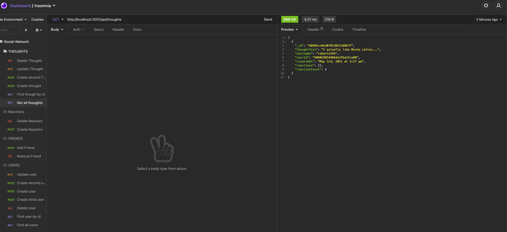

# 

# Social-Network 

Back end for a social media network application. 
***

## **Table of Contents**
* [Walkthrough Videos](#walkthrough-videos)
* [Screenshot](#scrennshot)
* [Technology](#technology)
* [License](#license)
* [Contact](#contact)

### Walkthrough Videos

* User Routes: [here](https://drive.google.com/file/d/1tEBGdsm1pAXaU8pK2nCqU_BM9VIfJPMV/view)

* Thought Routes: [here](https://drive.google.com/file/d/16lIw1PJBqAX7OkuoWf839wrsoQe-3W-W/view)

### Screenshot

### Technology
* MongoDB
* Mongoose
* Node.js
* Express.js

### License
[MIT](https://opensource.org/licenses/MIT)

### **Contact**
Feel free to contact me with any questions or comments!
* Github: [agustinxmtz](https://github.com/agustinxmtz)
* LinkedIn: [Agustin Martinez](https://www.linkedin.com/in/agustin-martinez-6282aa1b3/)
* Email: agustinxmtz@gmail.com
